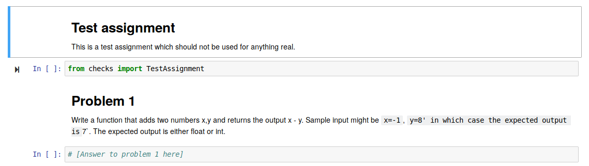

This package can be used to automatically generate code-writing assignments in jupyter notebook. The package is based on an extendable library of pre written problems, and implements checks for students to assess if they have answered the problem correctly as well as methods for submitting the answers to a central scoring platform (not ready yet). 

## Building an assignment
To build an assignment it must first be constructed. As of now this is done in assignmentsLibrary.py, where there is 
already one assignment constructed:

```python
TestAssignment = Assignment(AddTwoNumbers,
                            SubTwoNumbers, 
                            LinearRegressionWithSklearn,
                            MultiplyTwoNumbers,
                            joinStringArgs,
                            leadmd = """ # Test assignment 

                            This is a test assignment which should not be used for anything real.
                            """,
                            leadcode="from checks import TestAssignment"
                            )
```

The `TestAssignment` is then an instance of Assignment with 4 questions, a piece of markdown at the top of the document and a line of code which imports `TestAssignment` since this instance also contains the problem checker for the problem set. To build the corresponding problem set simply run 

```python
from checks import TestAssignment
TestAssignment.make_notebook('filename')
```

## Using the checker 
When you hand out the problem set to students it is a good idea to include a line of code with the `leadcode` argument which imports the assignment checker
```python
from checks import AssignmentName
```
Running this line imports the checker in the notebook. In TestAssignment the first question is to add two numbers: 

<p align="center">

</p>

Students will then have to write a function to solve this problem, once they are done they can use the `@AssignmentName.submit()` decorator to validate their answer, all they need is to pass the question number so that submit knows which problem they wish to answer

```python
@Testassignment.submit(1)
def add(x,y):
    return x + y
```
```
Passed test with inputs (1, 1), returned 2
Passed test with inputs (2, 2), returned 4
Passed test with inputs (-2, 3), returned 1
Your answer to problem 1 is CORRECT. Remember to hand in your results when you finish.
```

# TODO:
- make it possible to submit to some kind of online service that allows teachers to easily see the progress of their students. 

- make it possible to read problem input output from a file in `question.py`. This will make it possible to completely hide 
  the answer from students (low priority).
## DONE: 
- Add pre-question cell to notebook with instructions.

